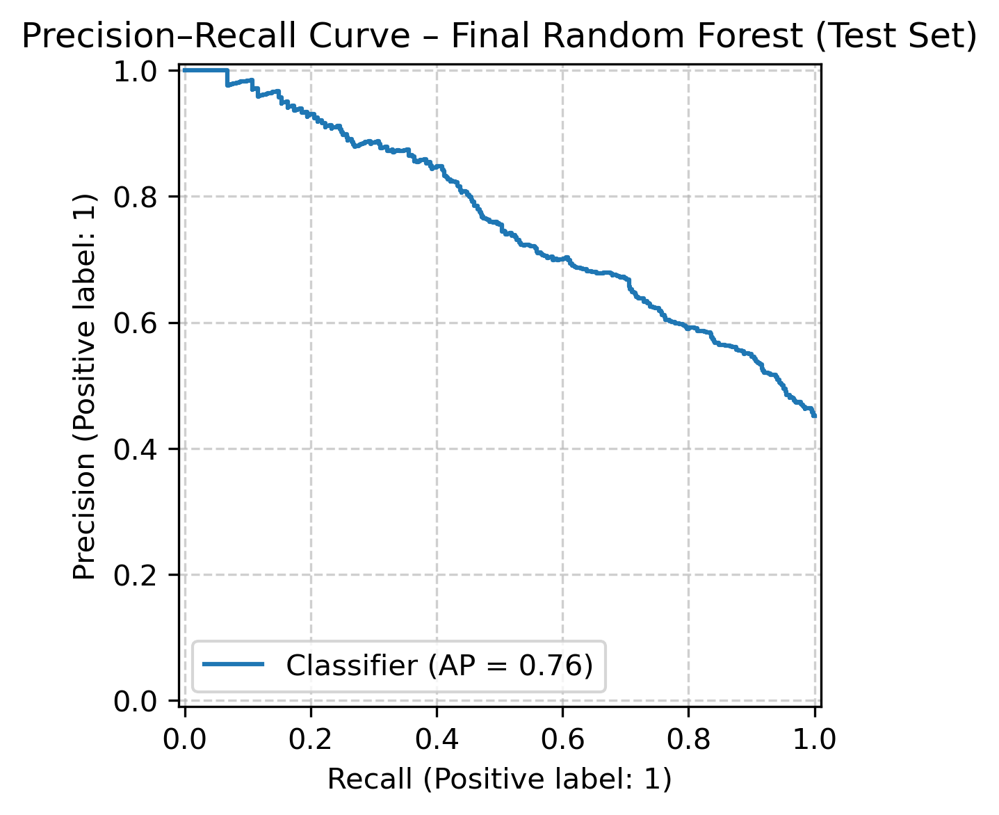

# Ames Mutagenicity Prediction using QSAR (Scaffold-Aware Classification)

## Project Overview
This project presents a QSAR-based machine learning workflow for predicting **Ames mutagenicity**, a key early-stage toxicity endpoint in drug discovery. The goal is to build a chemically realistic and interpretable classification model that generalizes to **previously unseen chemical scaffolds**, rather than memorizing closely related compounds.

The workflow emphasizes **data quality control**, **scaffold-aware validation**, and **appropriate evaluation metrics for toxicity prediction**, reflecting real-world ADMET modeling scenarios.

---

## Dataset
- **Source:** Public Ames mutagenicity benchmark dataset (N = 6512 compounds)
- **Task:** Binary classification  
  - `1` → Mutagenic  
  - `0` → Non-mutagenic
- **Class distribution:** Approximately balanced
- **SMILES:** Canonical SMILES provided

Basic data curation steps included:
- Validation of all SMILES strings using RDKit
- Removal of 6 invalid SMILES entries
- Confirmation of unique molecular structures (no duplicate SMILES)

---

## Chemical Representation

### Minimal Standardization Strategy
The dataset consists of curated and RDKit-validated SMILES strings. To preserve assay-relevant chemical information, **no aggressive chemical standardization** (such as salt stripping, uncharging, or tautomer canonicalization) was applied.  
Only **canonical SMILES generation** was used to ensure consistent molecular representation.

This approach avoids over-normalization while maintaining compatibility with descriptor and fingerprint calculations.

---

## Feature Engineering

### Molecular Descriptors (Physicochemical)
A small, interpretable set of Lipinski-style descriptors was computed using RDKit:
- Molecular Weight (MolWt)
- LogP (MolLogP)
- Hydrogen Bond Donors (HBD)
- Hydrogen Bond Acceptors (HBA)
- Topological Polar Surface Area (TPSA)
- Number of Rotatable Bonds

Descriptor quality checks confirmed:
- No missing values
- No infinite values
- Chemically reasonable distributions

### Molecular Fingerprints
- **Morgan fingerprints (ECFP4)**
- Radius = 2, Size = 2048 bits

### Hybrid Feature Set
For modeling, a **hybrid representation** was used by concatenating:
- Scaled molecular descriptors
- Binary Morgan fingerprints

---

## Data Splitting Strategy

### Scaffold-Aware Train–Test Split
To ensure chemically realistic evaluation, a **Murcko scaffold-based split** was applied:
- Compounds sharing the same scaffold were kept entirely within the same split
- This prevents structural leakage and overly optimistic performance

Final split:
- Train set: 5205 compounds
- Test set: 1301 compounds
- No scaffold overlap between train and test sets

Class distributions between splits were verified to be comparable.

---

## Modeling

### Models Evaluated
- Logistic Regression (baseline)
- Random Forest Classifier

Both models were evaluated using **scaffold-aware cross-validation** on the training set.

### Hyperparameter Tuning (Random Forest)
Critical hyperparameters were tuned:
- `n_estimators` (ensemble stability)
- `max_depth` (overfitting control)
- `min_samples_leaf` (generalization)

Model performance was stable across configurations, indicating robust learning rather than scaffold memorization.

---

## Evaluation Metrics
Given the toxicity context, multiple metrics were reported:
- Accuracy
- F1-score
- Recall (positive class)
- ROC-AUC
- PR-AUC (Average Precision)

ROC-AUC was used as a global discrimination metric, while **Precision–Recall analysis** was emphasized to better capture the trade-off between false positives and false negatives.

---

## Final Test Set Results (Random Forest)

- **Accuracy:** 0.70  
- **Precision:** 0.83  
- **Recall:** 0.43  
- **F1-score:** 0.56  
- **ROC-AUC:** 0.77  
- **PR-AUC:** 0.76  

The model exhibits **high precision but moderate recall**, reflecting a conservative prediction strategy typical for Ames mutagenicity tasks. This behavior prioritizes reliability of positive predictions while acknowledging the inherent difficulty and noise of toxicity endpoints.

---

## Precision–Recall Analysis
A Precision–Recall curve was generated on the scaffold-held-out test set to visualize model behavior across decision thresholds. The curve highlights the expected trade-off between sensitivity and false positives and supports informed threshold selection depending on the intended screening use case.
### Precision–Recall Curve (Test Set)

---

## Key Takeaways
- Scaffold-aware validation is essential for realistic QSAR toxicity modeling
- Hybrid descriptor + fingerprint representations provide robust performance
- Precision–Recall analysis is more informative than ROC curves alone for toxicity endpoints
- The final model generalizes reasonably to unseen chemical scaffolds without evidence of overfitting

---

## Tools & Libraries
- Python
- RDKit
- scikit-learn
- NumPy, pandas, matplotlib, seaborn

---

## Future Work
- Threshold optimization for recall-oriented screening
- Feature importance analysis (descriptor vs fingerprint contribution)
- Extension to multi-task toxicity prediction (e.g., Tox21)

## Author

**Nezihe Mohiuddin**  
📧 nezihemohiuddin@gmail.com
